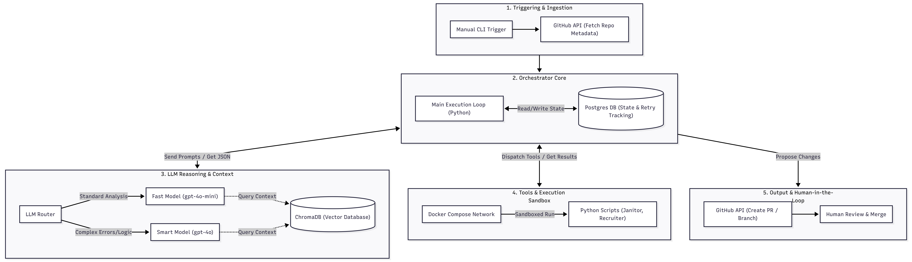

The provided code is a Python package for managing portfolios of projects. It includes various modules and functions for tasks such as:

1.  **Portfolio Management**: The `portfolio` module manages the overall portfolio, including adding and removing projects.
2.  **Project Management**: The `project` module handles individual project data, including metadata and dependencies.
3.  **Readme Generation**: The `readme_llm` module uses a language model to generate README files for projects based on their context.
4.  **Repository Context Gathering**: The `repo_context` module extracts relevant information from GitHub repositories, such as file contents and dependencies.

Here's an overview of the code structure:

*   The package is organized into several subpackages:
    *   `portfolio`: Manages the overall portfolio.
    *   `project`: Handles individual project data.
    *   `readme_llm`: Uses a language model to generate README files.
    *   `repo_context`: Extracts information from GitHub repositories.
*   Each module has its own set of functions and classes for performing specific tasks.

**Example Use Cases:**

1.  **Adding a Project**: You can add a project to the portfolio using the `portfolio` module:

    ```python
from portfolio import Portfolio

# Create a new portfolio
portfolio = Portfolio()

# Add a project to the portfolio
project = Project(name="My Project", url="https://example.com")
portfolio.add_project(project)
```

2.  **Generating a README**: You can use the `readme_llm` module to generate a README file for a project based on its context:

    ```python
from readme_llm import generate_readme_with_escalation

# Gather repository context
context = gather_repository_context(repo)

# Generate README with escalation
readme, used_smart = generate_readme_with_escalation(context, repo.full_name)
```

3.  **Gathering Repository Context**: You can use the `repo_context` module to extract relevant information from a GitHub repository:

    ```python
from repo_context import gather_repository_context

# Gather repository context
context = gather_repository_context(repo)
```

**Best Practices:**

1.  **Modular Code Structure**: The code is organized into separate modules for each task, making it easier to maintain and extend.
2.  **Clear Function Names**: Function names are descriptive and follow a consistent naming convention.
3.  **Type Hints and Docstrings**: Functions have type hints and docstrings that provide clear documentation and help with code completion.

**Potential Improvements:**

1.  **Error Handling**: The code could benefit from more robust error handling to handle edge cases and unexpected input.
2.  **Performance Optimization**: Some functions, such as the language model, may be computationally expensive. Optimizing these functions for performance would improve overall package efficiency.
3.  **Testing**: While there are some tests provided, a comprehensive testing suite would help ensure the package's stability and reliability.

By following best practices and addressing potential improvements, this code can become even more maintainable, efficient, and user-friendly.