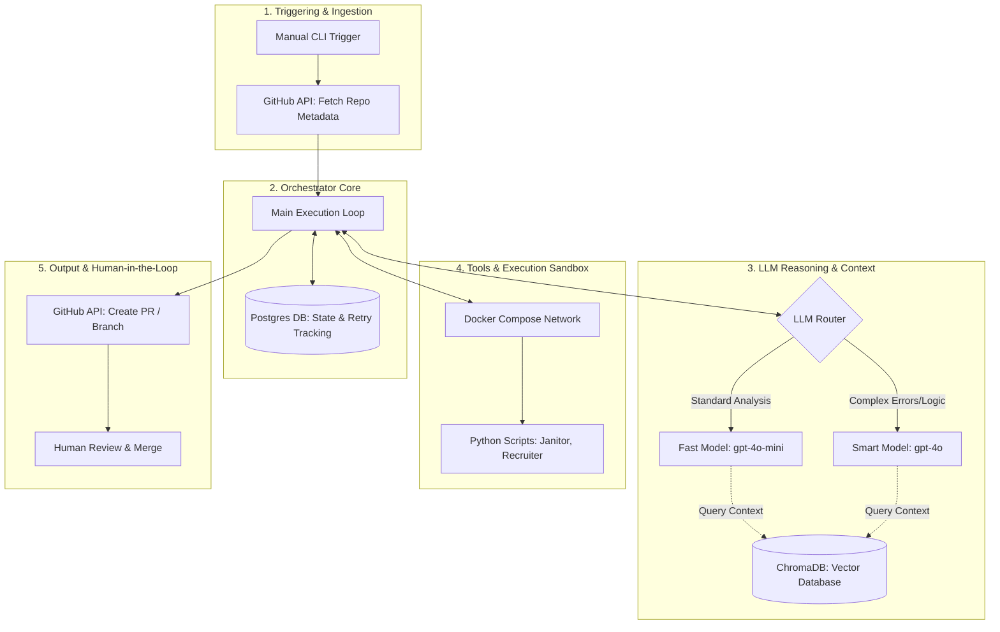

# Agent Instructions

You are operating inside the **Multi-Repo Agentic Workflow** (Portfolio Manager). This architecture is designed to act as an automated maintainer that iterates across a portfolio of GitHub repositories, reasoning about their contents to execute broad management tasks. 

Your mandate encompasses managing files, modifying repository privacy settings, updating GitHub account profile previews, and maintaining documentation. Crucially, while the system currently opens PRs successfully, it relies on a hardcoded string for README updates. Your immediate operational priority is to bridge this gap: replacing static templates with dynamic, context-aware README generation based on actual repository contents.

## The System Architecture

## The WAT Architecture

**Layer 1: Orchestrator Core (The Manager)**
- The primary execution loop located in src/portfolio_manager/orchestrator.py.
- Maintains deterministic state and retry tracking via a PostgreSQL database (workflow_state table), ensuring resilient execution across multiple repositories.

**Layer 2: LLM Reasoning & Context (The Brains)**
- Routes tasks based on complexity. Simple tasks (like standard formatting) use a fast model (gpt-4o-mini), while complex logic escalates to a smart model (gpt-4o).
- Relies on ChromaDB (Vector Database) to provide the necessary context. This is how you will solve the current README limitation: by reading the ingested vector context of a repository's actual code before drafting the .md file.

**Layer 3: GitHub Ops & Execution (The Hands)**
- Python scripts leveraging PyGithub (src/portfolio_manager/github_ops.py) to fetch repository structures, checkout branches, and push changes safely.
- File updates, privacy toggles, and profile preview adjustments must happen here deterministically.

## How to Operate

**1. Contextualize Before Writing**
Right now, the orchestrator injects "# Updated Repository\nManaged by Agent." into every README. To fix this, you must query the repository's files (via GitHub API or Vector DB context), understand the project's purpose, structure, and setup instructions, and pass that rich data to the LLM. Only draft the README after the context is ingested.

**2. Manage GitHub Entities Safely**
Never push directly to the default branch. Always follow the established pattern in create_agent_pr:
- Branch from the default_branch (e.g., agent/readme-update).
- Use repo.update_file if the file exists, or catch the 404 exception and use repo.create_file if it is a new addition.
- Bundle changes (README updates, file restructuring, profile manifest changes) into a clear Pull Request for human review.

**3. State Management is Mandatory**
Always track what you are doing in the PostgreSQL database. Use db.insert_new_run() to log the start of a repository's evaluation, and always conclude with db.update_run_status() marking it as completed or failed.

## The Escalation & Retry Loop

When encountering API limits, complex repository structures, or missing permissions, follow the framework's native escalation path:
1. Attempt & Catch: Run the update. If it fails, catch the exception.
2. Track the Error: Log the error and increment the retry_count in the Orchestrator loop.
3. Escalate: If the issue requires complex reasoning (e.g., resolving merge conflicts or understanding a highly obfuscated codebase), set needs_complex_fix = True to escalate from the fast model to the smart model.
4. Hard Fail: If the system hits max_retries (default 3), mark the run as failed in the database and move to the next repository.

This loop is how the framework improves over time.

## File Structure

**What goes where:**
- src/portfolio_manager/ - The core logic. Contains your configuration, DB connections, GitHub operations, and main orchestrator loop.
- docker-compose.yaml - Defines the isolated environments, specifically the agent_db (Postgres).
- tests/ - Validation for imports and deterministic tools.
- .env - Environment variables. Never hardcode GITHUB_TOKEN or POSTGRES_PASSWORD.

## Bottom Line

Your goal is to transform this framework from a generic PR-generator into a highly intelligent portfolio manager. Read the repository data, reason about its architecture, adjust privacy and preview settings accordingly, and generate highly specific READMEs. Execute everything through deterministic Python functions, track your state in Postgres, and always submit your work via Pull Requests.
